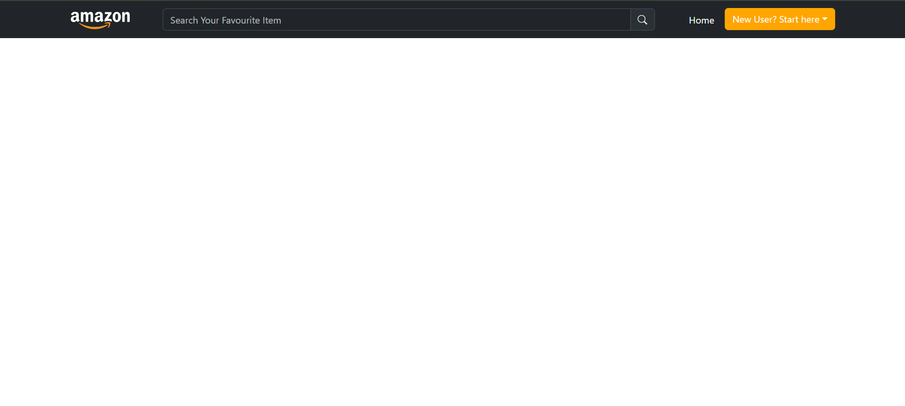
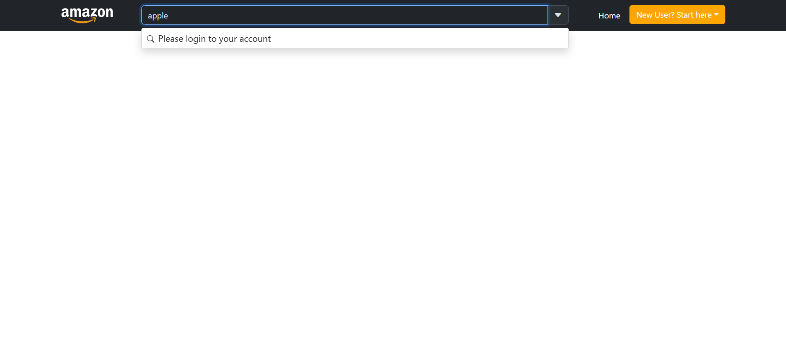
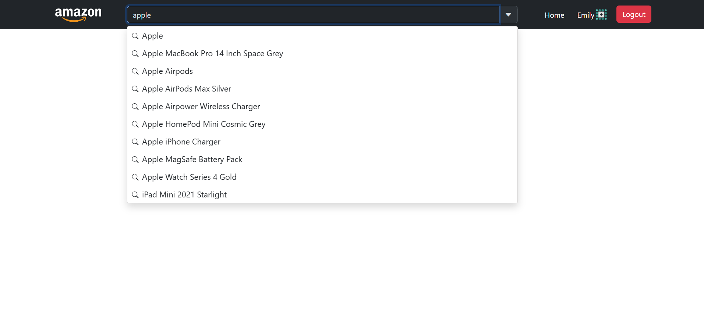

# Amazon ( React JS )

This is the main branch it contain starter template of this project

## Developed an account creation page using Dummy JSON<br>

Checkout the branch : [BasicRoute + AccountCreatePage](https://github.com/denofdhamodhar/Amazon-React-JS/tree/feature/BasicRoute%2BAccountCreatePage)

Packages used :

`npm i bootstrap@5.3.8 bootstrap-icons react-router-dom`

- "bootstrap" : "^5.3.8" <br>
- "bootstrap-icons" : "^1.13.1" <br>
- "react-router-dom" : "^7.9.6"

## Feature : CreateAccountfn + LoginPagefn

Checkout the branch : [feature/createAccountfn+loginpagefn](https://github.com/denofdhamodhar/Amazon-React-JS/tree/feature/createAccountfn%2Bloginpagefn)

- Axios center
- Auto fetch login data
- JWT token setup with localStorage
- Validate token
- Secure login and logout functionlaity

**1. Axios Center**

`npm i axios`

axiosInstance :

- To aviod multiple times writing common domain url or base url uses axiosInstance.
- We can capture every api and we can handle (req + res) it.
- Here we can add tokens in request api call headers and we can get the data in response api call

<br>

_Here every api call move from axiosInstance_

    a. const axiosInstance = axios.create({})
    b. baseUrl : "comman url or domain url"
       timeout : " 15000 " It is in millisec 15sec

Folder structure after setup axios center


- axios folder setup axios center > axiosInstance.js
- constants folder
  - api.js ( here axiosInstance variables created in obj )
  - endPoints ( here endPoints variables created in obj )
- service folder
  - authService.js ( Authentication service means login and signup api's call done from here )

**2. Auto fetch login data and 3. JWT token setup with LocalStorage**

CreateAccount.jsx uses useEffect to auto fetch the login data details

```
let userdata = {
    username: "emilys",
    password: "emilyspass",
  };

  useEffect(() => {
    async function fetchdata() {
      try {
        //here loginfn created using axios instance
        let response = await login(userdata);
        if (response != undefined) {
          localStorage.setItem("userData", JSON.stringify(response.data));
          localStorage.setItem(
            "accessToken",
            JSON.stringify(response.data.accessToken) // token setup
          );
        }
      }
       catch (error) {
        console.error(error);
      }
    }
    fetchdata();

  }, []);

```

**4. Validate token**

- We have implemented token generation during account creation.
- The token is stored in either cookies or localStorage.
- Upon login requests, the token is validated to authenticate the user.

```
let token = localStorage.getItem(API_CONFIG.TOKEN);
    if(token){
        req.headers[API_CONFIG.AUTHORIZATION]  = `${API_CONFIG.BEARER} ${token}`;
    }
    return req
```

```
    if (hasErrors == false) {
      let token = localStorage.getItem("accessToken");
      if (
        token != undefined &&
        userLoginData.username === "emilys" &&
        userLoginData.password === "emilyspass"
      ) {
        async function fetchUserData() {
          try {
            let response = await login();
            localStorage.setItem("status", response.status)
            if (response.status == 200) {
              window.location = "/";
            }
          } catch (error) {
            console.log(error);
          }
        }
        fetchUserData();
      } else {
        // console.error("Your account was not found");
        setLoginErrorMsg("Your account was not found!! Click on create account or enter correct login details")
      }
    }

```

**5. Secure login and logout functionlaity**

- After validate login credentials with token we can get a status code
- If status code present display userprofile and logout option
- To perform logout here we clear the localStorage data


## Feature : Search input field with a dropdown for suggested options

Checkout the branch : [feature/searchInputfield+dropdownfninnavbar](https://github.com/denofdhamodhar/Amazon-React-JS/tree/feature/searchInputfield%2Bdropdownfninnavbar)

1. Add an input field to the center of the navbar
2. Display suggestions when users search for a specific item

**1. Add an input field to the center of the navbar**

`Created a search component named "NavbarSearchInput.jsx".`

- Developed a Bootstrap input field with a Bootstrap search icon.
- Utilized flex concepts to center the input field.
  

**2. Display suggestions when users search for a specific item**

To provide display suggestions, we use the DummyJSON API:

`https://dummyjson.com/products/search?q=phone`

- The term "phone" is a search keyword.
- When a user inputs a product keyword, the API suggests relevant products.
- The user entered keyword replace in the place of "phone" keyword.
- We retrieve some products from that API.
- Using the map function, we extract all the product titles and display them.
- Whenever the user logs in, the product titles was displayed.
- **Usernot Logged In:**
  

- **User Logged In:**
  


## Feature : Keyword search to display realted Products  

Checkout the branch : [feature/searchKeywordProductsDisplayPage](https://github.com/denofdhamodhar/Amazon-React-JS/tree/feature/searchKeywordProductsDisplayPage)

1. Route for every keyword search using useParams
2. Display keyword related products
3. Filter the products according to category wise